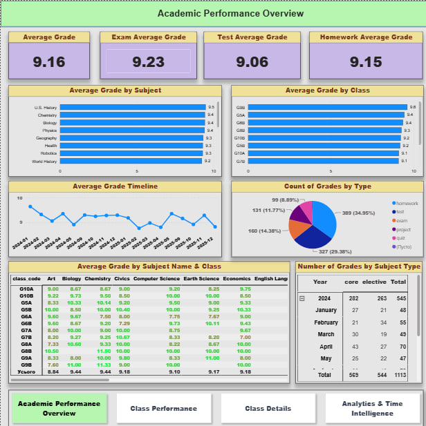
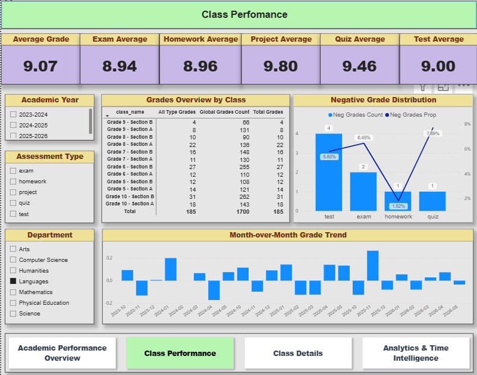
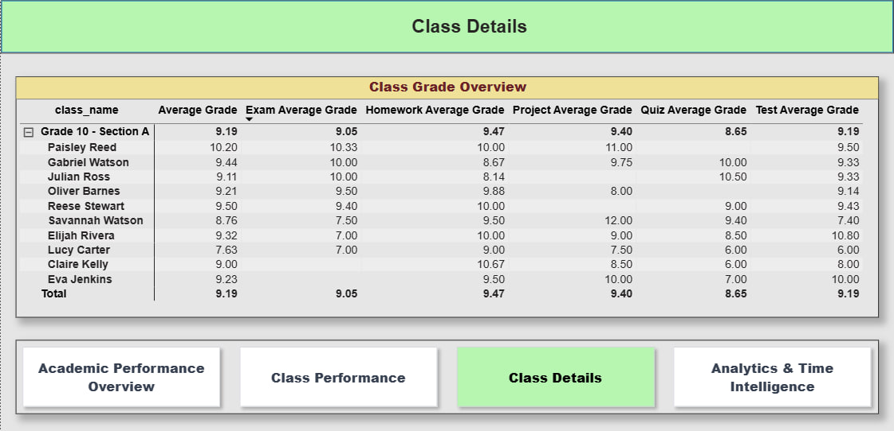
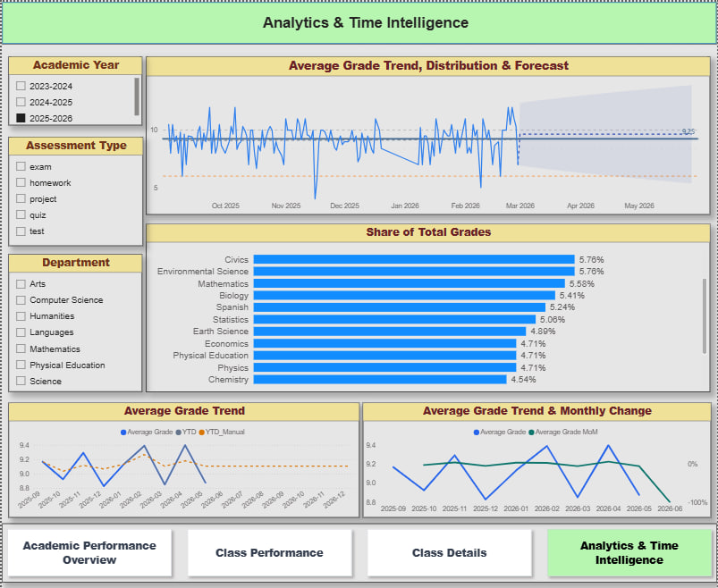

# 🎓 Academic Performance Dashboard

Interactive Power BI dashboard designed to monitor academic performance, analyze grade trends, and support data-driven decision-making.

**Tools:** Power BI • Power Query • DAX • Data Modeling

---

## 📖 Overview

Developed an interactive dashboard that transforms academic data into clear, actionable insights. The report enables users to monitor key performance indicators, compare departments and classes, analyze academic trends, and explore performance through interactive visualizations.

---

## 🎯 Business Goal

Provide school administrators with a centralized reporting solution to monitor academic performance, identify trends, and support informed decision-making.

---

## ⚙️ Technical Highlights

- Designed a star schema data model
- Built custom DAX measures and KPIs
- Applied Power Query for data transformation
- Implemented Time Intelligence calculations
- Added interactive navigation and slicers
- Created forecasting for performance trends

---

## 🛠 Dashboard Features

- KPI cards
- Department & class comparison
- Grade trend analysis
- Interactive filters
- Matrix analysis
- Time Intelligence
- Forecasting
- Page navigation

---

## 📸 Dashboard Preview

### Academic Performance Overview



### Class Performance



### Class Details



### Analytics & Time Intelligence



---

## 📂 Repository Structure

```text
powerbi-academic-performance-dashboard/
│
├── dashboard/
│   ├── academic_performance.pbix
│   └── academic_performance.pdf
│
├── images/
│   ├── academic_performance_overview.jpg
│   ├── class_performance.jpg
│   ├── class_details.jpg
│   └── analytics_time_intelligence.jpg
│
└── README.md
```

---

## 🚀 Getting Started

1. Clone or download this repository.
2. Open `academic_performance.pbix` in Power BI Desktop.
3. Explore the report using the navigation buttons and interactive filters.
